```{r, include = FALSE}
knitr::opts_chunk$set(
  collapse = TRUE,
  comment = "#>",
  out.width = "80%"
)
```

This is a step-by-step guide to running a standard microCT analysis using
`klct`. It assumes you already have your data exported from the NeoScan scanner
into CSV files.

# Create an RStudio Project

The first step is to create a folder that will contain your data and analysis.

First, open RStudio. Then, create a new RStudio project:
`File > New Project...`

Select `New Directory`:

```{r echo = FALSE}
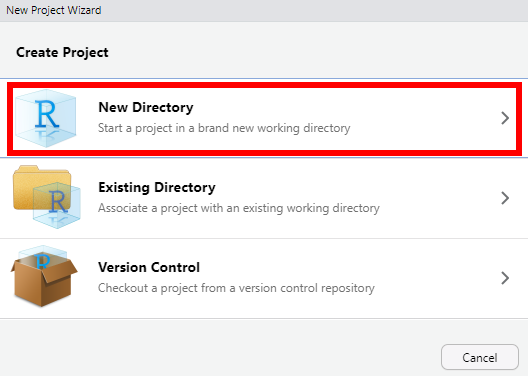
```

Select `New Project`:

```{r echo = FALSE}
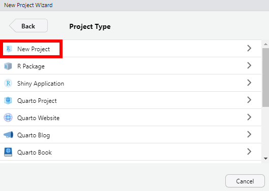
```

Type the name of the folder you would like to create, and select the location
you would like to create the folder. Then click `Create Project`:

```{r echo = FALSE}
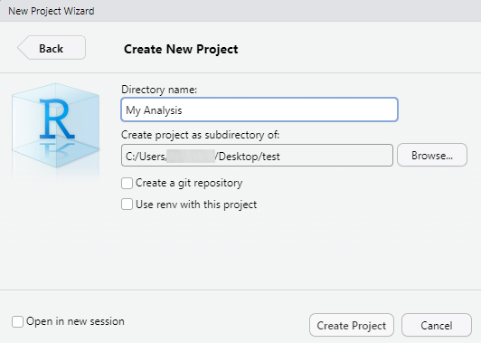
```

You should now have a new folder which contains a `.Rproj` file with the name of
the project and possibly a `.Rproj.user` folder.

```{r echo = FALSE, out.width = "30%"}
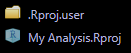
```

These are safe to ignore, but don't delete or move them.

# Prepare Your Data

Create a subfolder called `data` inside your project folder. Place the following
CSV files into the `data` folder:

- **`mouse-table.csv`** -- A lookup table defining each sample's Animal ID, AS
  (key registry) number, sex, and treatment (**required**).
- **`spine_trabecular_data.csv`** -- Trabecular bone data for the lumbar
  vertebra (optional).
- **`femur_metaphysis_data.csv`** -- Combined cortical and trabecular bone data
  for the femoral metaphysis (optional).
- **`femur_diaphysis_data.csv`** -- Cortical bone data for the femoral
  diaphysis (optional).

Only the mouse table is required. If any of the three data files are missing,
the corresponding section will simply be omitted from the report. This allows
you to generate a report for any combination of skeletal sites.

Your project folder should now look something like this:

```{r echo = FALSE}
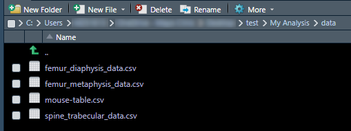
```

These files technically can be renamed whatever you want, but you will have to
update the file names in the analysis report. I'll show you how to do that
below.

## The Mouse Table

The mouse table CSV file maps each animal's AS number to its sex and treatment
(or genotype). It should have the columns `Animal ID` (optional), `AS`, `Sex`,
and `Treatment` (or `Genotype`). For example:

```{r echo = FALSE, out.width = "30%"}
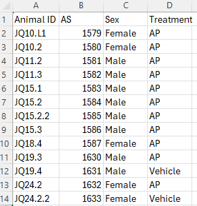
```

Sex can be coded as `Female`/`Male`, `F`/`M`, or `female`/`male` --- `klct`
will standardize these to `F` and `M`.

## The Data Files

The data CSV files are created by the
[`neoscan-data-assembler`](https://github.com/KhoslaLab/neoscan-data-assembler/releases/tag/v1.0.0)
software tool, which assembles CSV files from the tab-separated text files
produced by the NeoWorks program. Each file should contain an `AS` column that
matches the AS numbers in the mouse table, along with the bone measurement
columns. For example, the spine trabecular data file might look like this:

```{r echo = FALSE}
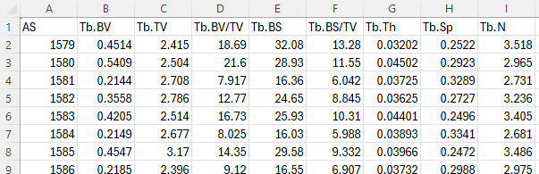
```

# Generate the Analysis Template

Click the `Addins` button at the top of RStudio:

```{r echo = FALSE}
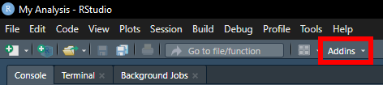
```

Under the `klct` heading, select the template that matches your analysis design:

- **NeoScan Two Treatment Comparison Setup** --- Compares two treatment groups
  with each sex analyzed separately.
- **NeoScan Two Treatment Two Sex Comparison Setup** --- Runs a full two-way
  (Treatment × Sex) analysis.

Mayo-themed versions of each template are also available.

```{r echo = FALSE, out.width = "50%"}
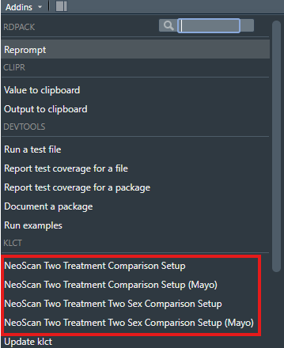
```

You should now have a new `.Rmd` file labeled with today's date in your project
folder:

```{r echo = FALSE}
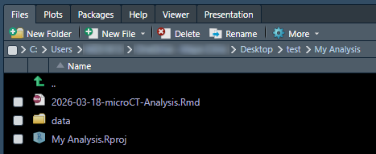
```

Alternatively, you can generate the template from the R console:

```r
library(klct)
create_two_treatment_comparison()
# or
create_two_treatment_two_sex_comparison()
```

For Mayo-themed templates, add `mayo = TRUE`:

```r
create_two_treatment_comparison(mayo = TRUE)
# or
create_two_treatment_two_sex_comparison(mayo = TRUE)
```

# Prepare the Report

Open the `.Rmd` file in RStudio. You can do this by clicking on the file name in
the `Files` pane.

The `.Rmd` file is just a text file, and it should now be open for editing
within RStudio:

```{r echo = FALSE}
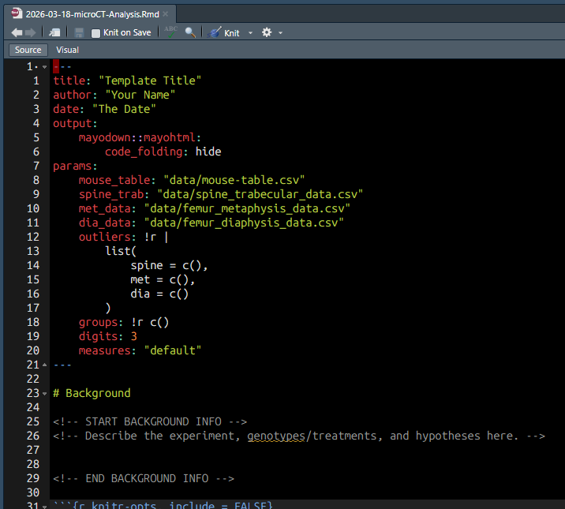
```

## Edit the Metadata

At the top of the file, replace `Template Title` with the title you'd like to
give the report, `Your Name` with your name, and `The Date` with today's date.

```{r echo = FALSE}
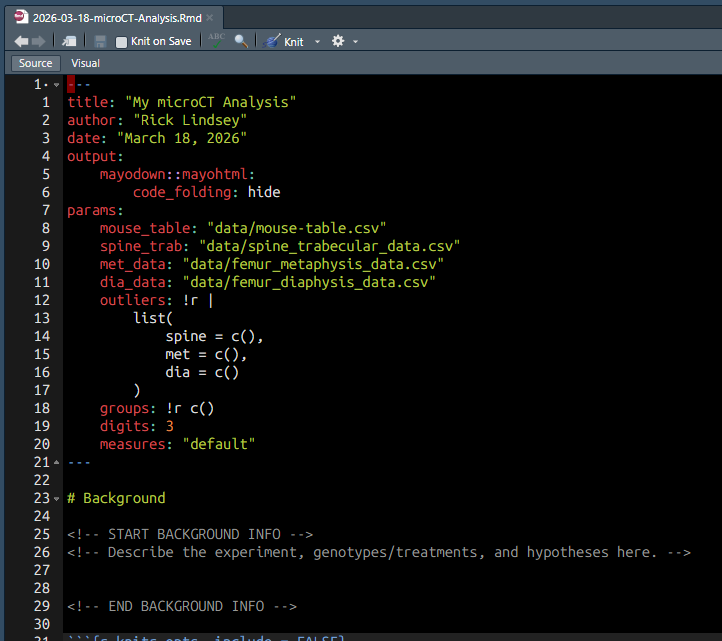
```

## Update File Paths (if needed)

Below the title information, the `params` section contains the file paths to
your data files:

```yaml
params:
    mouse_table: "data/mouse-table.csv"
    spine_trab: "data/spine_trabecular_data.csv"
    met_data: "data/femur_metaphysis_data.csv"
    dia_data: "data/femur_diaphysis_data.csv"
```

If you have renamed any of the files or placed them somewhere other than
the `data` folder, update the file paths here.

If you do not have data for a particular skeletal site, you can either delete
that file from the `data` folder or clear its path in the `params` section
(set it to `""`). The report will skip any section whose data file is not
found.

## Specify Outliers (optional)

To exclude specific animals from the analysis, add their AS numbers to the
`outliers` parameter. Outliers are site-specific, so you can exclude different
animals from each skeletal site:

```yaml
    outliers: !r |
        list(
            spine = c(1234, 5678),
            met = c(),
            dia = c(1234)
        )
```

If you have excluded any outliers, you may wish to include an explanation (e.g.,
broken metaphysis). Scroll down until you see:

```html
<!-- START OUTLIER INFO -->
<!-- Describe the reason(s) for excluding outliers, if relevant (e.g., broken met). -->


<!-- END OUTLIER INFO -->
```

Add your explanation in the empty space between `START OUTLIER INFO` and 
`END OUTLIER INFO`.

## Set Group Order (optional)

By default, groups are ordered alphabetically. To set a specific order (e.g., to
make the control group appear first), list the group names in the `groups`
parameter:

```yaml
    groups: !r c("Vehicle", "AP")
```

## Choose Measures (optional)

The `measures` parameter controls which bone parameters are analyzed:

- `"default"` -- Analyze a sensible subset of commonly reported parameters (the
  default).
- `"all"` -- Analyze all detected parameters.

```yaml
    measures: "all"
```

## Add Background Information (optional)

Optionally, add background information about the project in the first section of
the document, between `START BACKGROUND INFO` and `END BACKGROUND INFO`. This
will appear at the top of the final report.

```html
<!-- START BACKGROUND INFO -->
<!-- Describe the experiment, genotypes/treatments, and hypotheses here. -->


<!-- END BACKGROUND INFO -->
```

Don't change anything else lower down in the file.

# Run the Report

Make sure your file is saved by pressing `Ctrl + S` or clicking the `Save`
button:

```{r echo = FALSE}
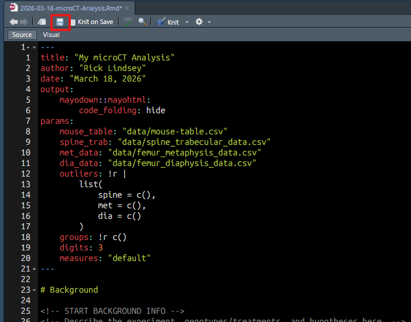
```

Now, generate the report by clicking `Knit` (or by pressing
`Ctrl + Shift + K`):

```{r echo = FALSE}
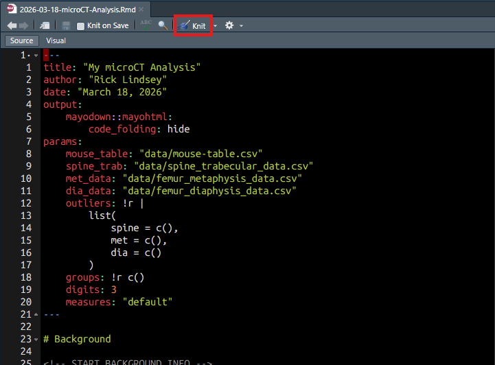
```

After a few seconds, the final report should appear in the `Viewer` pane. The
report contains tabbed sections for each skeletal site, with separate tabs for
parametric and nonparametric results, plots, and raw data:

```{r echo = FALSE}
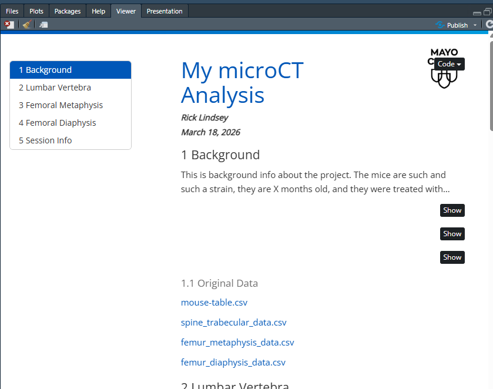
```

The final report is now in a `.html` file in your working folder:

```{r echo = FALSE}
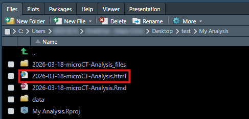
```

You can do anything you would do with a regular file with this `.html` file:
save it anywhere you like, attach it to an email, etc. You can also double click
it to open it in your default web browser for easier viewing.